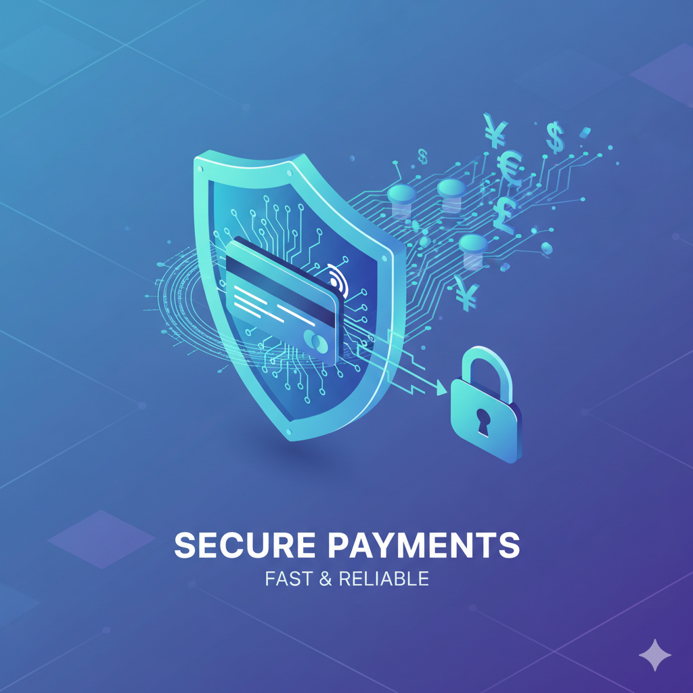

  <h1>Secure Payments</h1>
  

## 🧩 1️⃣ Definición del Proyecto
### **Nombre:** Secure Payments
### **Tecnologías:**
- ***Backend:*** Spring Boot 3, Java 17, Maven
- ***Base de datos:*** MySQL
- ***Frontend:*** Angular 20
- ***Arquitectura:*** REST API con principios SOLID

## ✅ 2️⃣ Requerimientos funcionales mínimos
<table border="1" cellspacing="0" cellpadding="5" style="border-top: 0; border-bottom: 0; border-left: 0; border-right: 0; width: 100%;">
  <thead>
    <tr>
      <th style="border-left: 0; border-right: 0; border-top: 0;">N°</th>
      <th style="border-left: 0; border-right: 0; border-top: 0;">Requerimiento Funcional</th>
      <th style="border-left: 0; border-right: 0; border-top: 0;">Descripción</th>
    </tr>
  </thead>
  <tbody>
    <tr>
      <td style="border-left: 0; border-right: 0; border-top: 0;">RF1</td>
      <td style="border-left: 0; border-right: 0; border-top: 0;">Registrar un pago</td>
      <td style="border-left: 0; border-right: 0; border-top: 0;">El sistema debe permitir registrar un nuevo pago, indicando método, monto y usuario.</td>
    </tr>
    <tr>
      <td style="border-left: 0; border-right: 0; border-top: 0;">RF2</td>
      <td style="border-left: 0; border-right: 0; border-top: 0;">Consultar historial de pagos</td>
      <td style="border-left: 0; border-right: 0; border-top: 0;">El usuario o administrador debe poder listar todos los pagos registrados.</td>
    </tr>
    <tr>
      <td style="border-left: 0; border-right: 0; border-top: 0; border-bottom: 0;">RF3</td>
      <td style="border-left: 0; border-right: 0; border-top: 0; border-bottom: 0;">Agregar nuevos métodos de pago</td>
      <td style="border-left: 0; border-right: 0; border-top: 0; border-bottom: 0;">El administrador debe poder agregar métodos de pago sin modificar el código existente (OCP).</td>
    </tr>
  </tbody>
</table>

## 🧱 3️⃣ Entidades principales (4)
1. **Usuario** -> Persona que realiza o administra pagos.

2. **Pago** -> Transacción realizada por un usuario mediante un método de pago.

3. **Método de Pago** -> Define el tipo de pago (tarjeta, PayPal, transferencia, etc.).

4. **Rol** -> Permite distinguir entre cliente y administrador.

## 💡 4️⃣ Cumplimiento de Principios SOLID
<table border="1" cellspacing="0" cellpadding="5" style="border-top: 0; border-bottom: 0; border-left: 0; border-right: 0; width: 100%;">
  <thead>
    <tr>
      <th style="border-left: 0; border-right: 0; border-top: 0;">Principio</th>
      <th style="border-left: 0; border-right: 0; border-top: 0;">Aplicación en el Proyecto</th>
    </tr>
  </thead>
  <tbody>
    <tr>
      <td style="border-left: 0; border-right: 0; border-top: 0;">SRP</td>
      <td style="border-left: 0; border-right: 0; border-top: 0;">Cada clase tendrá una única responsabilidad: controladores, servicios, repositorios y entidades estarán separados.</td>
    </tr>
    <tr>
      <td style="border-left: 0; border-right: 0; border-top: 0;">OCP</td>
      <td style="border-left: 0; border-right: 0; border-top: 0;">Se podrán agregar nuevos métodos de pago extendiendo una clase abstracta o implementando una interfaz, sin modificar el código existente.</td>
    </tr>
    <tr>
      <td style="border-left: 0; border-right: 0; border-top: 0; border-bottom: 0;">DIP (Inversión de Dependencias)</td>
      <td style="border-left: 0; border-right: 0; border-top: 0; border-bottom: 0;">Los controladores dependen de interfaces (servicios), no de implementaciones concretas. Las dependencias serán inyectadas por Spring.</td>
    </tr>
  </tbody>
</table>